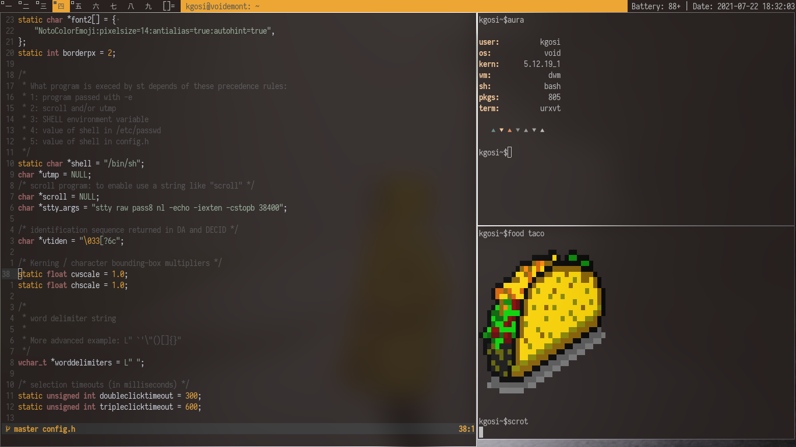

# Dotfiles
This are my personal dotfiles for all the applications i use
### The set up currently

* void linux(musl)
* cwm as the window manager
* nvim as my editor
* uxterm as my terminal emulators
* terminus font 

### Other applicatios
* tmux
* zathura
* dunst

### Preview 

